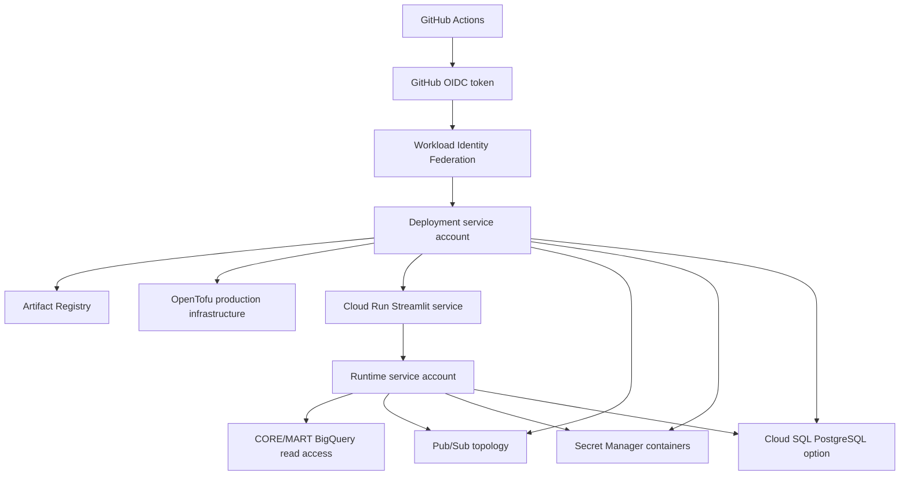

# Production Architecture Preparation

Stage 19A defines the production deployment shape without executing it.
No billing, IAM, API, Pub/Sub, BigQuery, Secret Manager, Cloud SQL,
Artifact Registry, Cloud Run, Workload Identity Federation, or OpenTofu
apply operation is performed by this stage.

## Deployment Flow



## State Boundaries

The existing `infra/` root remains the development state boundary and
continues to manage the current BigQuery development resources. Stage 19A
does not rename, move, import, or refactor those resources.

Production uses separate roots:

- `infra/bootstrap/`: one-time privileged bootstrap resources.
- `infra/environments/production/`: normal production infrastructure.
- `infra/modules/`: focused reusable modules for Cloud Run and Pub/Sub.

The production root is configured for a GCS backend, but the bucket is
created by the bootstrap root. Bootstrap is therefore a deliberate
one-time local or administrator-run operation, followed by explicit
state migration/initialization for the production root. No remote backend
is initialized against GCP during Stage 19A validation.

## Workload Identity Federation

Production CI/CD is designed to use GitHub OIDC and Workload Identity
Federation. The design avoids long-lived service-account JSON keys.

The bootstrap root models:

- a deployment service account;
- a GitHub Workload Identity Pool and provider;
- repository and GitHub Environment restrictions;
- deployer permissions needed for reviewed production planning and
  future deployment;
- access to the remote-state bucket.

The intended trust chain is:

```text
GitHub Actions -> OIDC -> Workload Identity Provider -> Deployment service account
```

Repository trust is scoped to the configured `owner/repository` and the
protected GitHub Environment named `production` by default.

## Runtime Identity

The Cloud Run application uses a dedicated runtime service account. It is
separate from the deployment service account and from any default
Compute Engine or Cloud Build identity.

Runtime access is intentionally narrow:

- BigQuery job execution in the runtime project;
- read access to configured CORE and MART datasets only;
- no RAW dataset access;
- access to exact runtime Secret Manager secret containers;
- Pub/Sub publisher/subscriber access for the modeled topology;
- Cloud SQL client permission only when managed PostgreSQL is enabled.

The runtime service account does not receive Artifact Registry write
permissions.

## Production Resource Graph

The production root models:

- prerequisite service APIs;
- Artifact Registry repository for Docker images;
- runtime service account;
- Secret Manager secret containers without secret versions;
- optional Cloud SQL PostgreSQL for LangGraph checkpoint persistence;
- Pub/Sub canonical topic, processing subscription, dead-letter topic,
  and inspection subscription;
- CORE/MART BigQuery dataset IAM for the runtime identity;
- optionally gated Cloud Run service deployment.

Cloud Run deployment is gated by `enable_cloud_run_service`, which
defaults to `false`. Managed PostgreSQL is gated by
`enable_managed_postgres`, which also defaults to `false`. The Cloud SQL
Admin API is included only when managed PostgreSQL is explicitly enabled.
The dashboard-first initial deployment path does not require Cloud SQL.

## Deployment Phases

Production deployment is intentionally split:

1. Foundation: APIs, state bucket, WIF, Artifact Registry, identities,
   Pub/Sub, secret containers, and optionally Cloud SQL after cost review.
   With the dashboard-first strategy and `enable_managed_postgres=false`,
   Cloud SQL and the Cloud SQL Admin API remain out of scope.
2. Secret seeding: human-approved Secret Manager versions for credentials
   and connection strings. Secret values never enter Git, workflows,
   Docker layers, OpenTofu source, or example tfvars.
3. Application: immutable container image exists, secrets exist, and
   Cloud Run deployment is explicitly enabled.

## Application Configuration

The container uses the existing Streamlit application:

```shell
uv run streamlit run src/supplychain/ui/app.py
```

The production container starts Streamlit headlessly, binds to
`0.0.0.0`, and uses the runtime-provided `PORT`. Non-secret application
configuration is passed as environment variables. Secrets are referenced
from Secret Manager.

The current Gemini provider/key capability blocker remains external to
the application and must be revalidated before relying on live
investigations in production.

## Observability

Stage 18 structured JSON stdout logs remain the default production log
path, which Cloud Run can collect naturally. OpenTelemetry traces and
metrics remain instrumented, but no remote telemetry exporter is added in
Stage 19A. Exporter selection belongs to the later deployment stage.

## Rollback

Application rollback is based on deploying a previous immutable image tag
or digest and reviewing the resulting OpenTofu plan. Infrastructure
rollback is not blind state rollback; changes are reviewed through plan
and apply. Destructive database rollback is out of scope.

## Public Access

`allow_unauthenticated` defaults to `false`. Public access must be a
separate explicit production decision.
